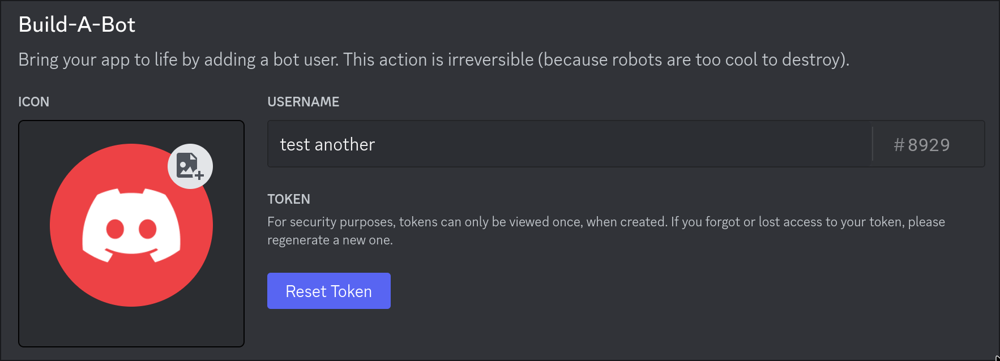

<div align="center">
  <h1><code>Discord Flows</code></h1>
  <a href="https://docs.rs/discord-flows/">
    
  </a>
  <a href="https://crates.io/crates/discord-flows">
    
  </a>

  Discord Integration for [Flows.network](https://test.flows.network)
</div>

## Quick Start

There is a echo bot, but plain text:

```rust
use discord_flows::{get_client, listen_to_event, model::Message};

#[no_mangle]
#[tokio::main(flavor = "current_thread")]
pub async fn run() {
    let token = std::env::var("DISCORD_TOKEN").unwrap();

    listen_to_event(token.clone(), move |msg| handle(msg, token)).await;
}

async fn handle(msg: Message, token: String) {
    let client = get_client(token);
    let channel_id = msg.channel_id;
    let content = msg.content;

    if msg.author.bot {
        return;
    }

    _ = client
        .send_message(
            channel_id.into(),
            &serde_json::json!({
                "content": content,
            }),
        )
        .await;
}
```

[get_client()] is a `Discord` constructor that represents a bot.
If you don't have a token, please see this [section](#Creating-a-Bot-Account).

[listen_to_event()] is responsible for registering a listener for the bot
represented by the `bot_token`. When a new `Message` coming, the callback
is called with received `Message`.

## Creating a Bot Account

The following is excerpted from
[discord.py docs](https://discordpy.readthedocs.io/en/stable/discord.html)

1. Make sure you’re logged on to the Discord [website](https://discord.com/).
2. Navigate to the [application page](https://discord.com/developers/applications).
3. Click on the “New Application” button.

4. Give the application a name and click “Create”.

5. Navigate to the “Bot”.
6. Make sure that Public Bot is ticked if you want others to invite your bot.
7. Click on the "Reset Token" button.

8. Confirm reset by clicking "Yes, do it!" button.

9. Copy the token using the “Copy” button.
> It should be worth noting that this token is essentially your bot’s password.
> You should never share this with someone else.
> In doing so, someone can log in to your bot and do malicious things,
> such as leaving servers, ban all members inside a server,
> or pinging everyone maliciously.
>
> The possibilities are endless, so **do not share this token**.
>
> If you accidentally leaked your token,
> click the “Regenerate” button as soon as possible.
> This revokes your old token and re-generates a new one.
> Now you need to use the new token to login.
10. Keep your token in a **safe** place, the token will only be shown **once**.
